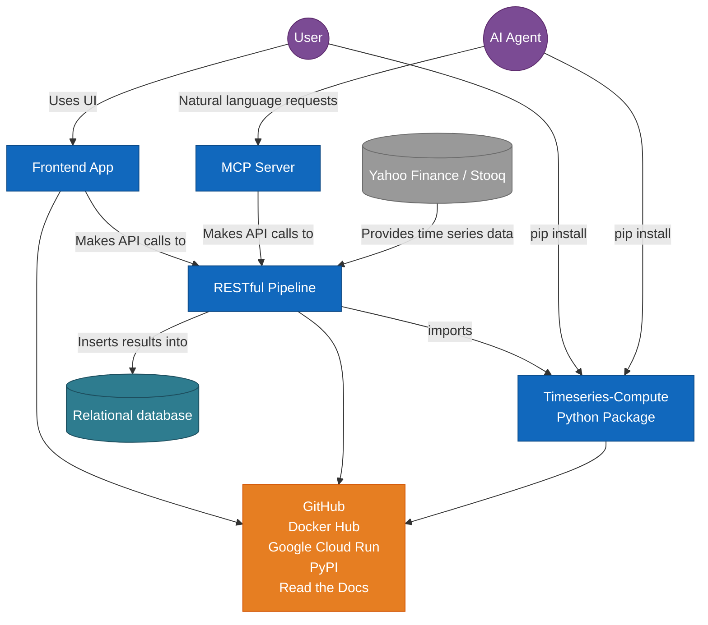
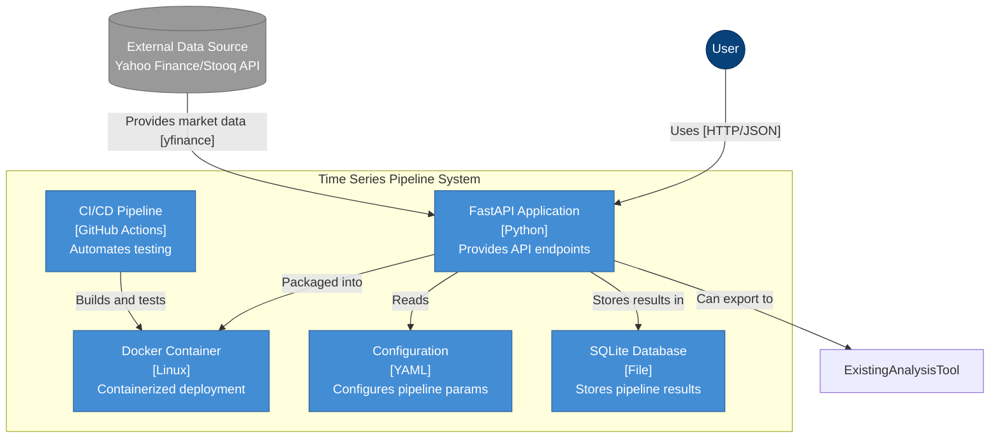
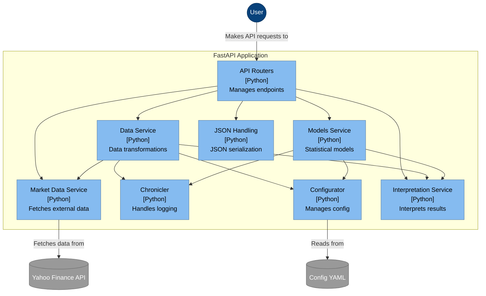

# Timeseries API

[](https://github.com/garthmortensen/timeseries-api)
[](https://hub.docker.com/r/goattheprofessionalmeower/timeseries-api)


[](https://app.codacy.com/gh/garthmortensen/timeseries-api/dashboard)
[](https://codecov.io/gh/garthmortensen/timeseries-api)

## Overview

```ascii
  ████████╗██╗███╗   ███╗███████╗███████╗███████╗██████╗ ██╗███████╗███████╗
  ╚══██╔══╝██║████╗ ████║██╔════╝██╔════╝██╔════╝██╔══██╗██║██╔════╝██╔════╝
     ██║   ██║██╔████╔██║█████╗  ███████╗█████╗  ██████╔╝██║█████╗g ███████╗
     ██║   ██║██║╚██╔╝██║██╔══╝  ╚════██║██╔══╝  ██╔══██╗██║██╔══╝m ╚════██║
     ██║   ██║██║ ╚═╝ ██║███████╗███████║███████╗██║  ██║██║███████╗███████║
     ╚═╝   ╚═╝╚═╝     ╚═╝╚══════╝╚══════╝╚══════╝╚═╝  ╚═╝╚═╝╚══════╝╚══════╝
              █████╗ ██████╗ ██╗
             ██╔══██╗██╔══██╗██║
             ███████║██████╔╝██║
             ██╔══██║██╔═══╝ ██║
             ██║  ██║██║     ██║
             ╚═╝  ╚═╝╚═╝     ╚═╝
```

A production-grade FastAPI pipeline for time series analysis with ARIMA and GARCH modeling.

This project provides multiple interfaces for financial and econometric data analysis:
- **CLI interface** for command-line usage
- **REST API** with FastAPI endpoints
- **GraphQL API** for flexible queries
- **MCP Server** for direct LLM agent integration

### Features

- **REST & GraphQL APIs** for time series analysis with comprehensive OpenAPI documentation
- **MCP Server Integration** - Expose all endpoints as structured tools for LLM agents
- **Advanced Statistical Modeling** - ARIMA and GARCH modeling capabilities with spillover analysis
- **Multi-source Data Support** - Generate synthetic data or fetch real market data (Yahoo Finance, Stooq)
- **Comprehensive Data Processing** - Scaling, stationarity testing, returns conversion, and missing data handling
- **Production Ready** - Docker containerization, comprehensive test suite, and CI/CD pipeline
- **Real-time Analysis** - Rolling spillover analysis and volatility forecasting
- **Human-readable Interpretations** - Automatic generation of plain English explanations for statistical results

## Difficult lessons

- Too late in the game I created `export_data()` utility.

- My logging script broke down at some point and I never restored it to fully functional. I really need a top-grade logging utility.

- Never ever take the shortcut of using undefined dataframes/nested dicts as inputs and returns. Take the time to expand so that the function signature provides a clear and open API contract for downstream users.

- I'm at odds with the iterative process in this project. By doing a first iteration across package then api then app, and and looping to 2nd full iteration, i spent the majority of time resolving integration issues. Update the package? Now everything downstream needs integrating, and it's difficult to determine what exactly broke. For this project, i needed to spend 5x more effort on determining data structures, methodology, and the entire garch pipeline before getting to work. I needed way more planning...though scope creep was also to blame.

- i should've made the api much more modular:

    ```py
    # services.py
    def make_stationary(df): …
    def fill_missing(df): …
    # …more steps…

    # routers/transforms.py
    from fastapi import APIRouter
    from services import make_stationary, fill_missing

    router = APIRouter(prefix="/transforms")
    @router.post("/stationary")
    def stationary(data: DataModel):
        return make_stationary(data)

    @router.post("/fill-missing")
    def fill_missing_endpoint(data: DataModel):
        return fill_missing(data)

    # routers/pipeline.py
    from fastapi import APIRouter, Depends
    from services import make_stationary, fill_missing, … 

    router = APIRouter(prefix="/pipeline")
    @router.post("/full")
    def full_pipeline(data: DataModel):
        df1 = make_stationary(data)
        df2 = fill_missing(df1)
        # …chain the rest…
        return df_final

    # main.py
    from fastapi import FastAPI
    from routers import transforms, pipeline

    app = FastAPI()
    app.include_router(transforms.router)
    app.include_router(pipeline.router)
    ```
### Integration Overview



## Quick Start

### Docker

Pull the Docker image:

```bash
docker pull goattheprofessionalmeower/timeseries-api
```

Run the container:

```bash
docker run -d -p 8001:8001 --name timeseries-api-container goattheprofessionalmeower/timeseries-api:latest
```

### Local Setup

1. Clone the repository:

   ```bash
   git clone https://github.com/garthmortensen/timeseries-api.git
   cd timeseries-api
   ```

2. Create a virtual environment:

   ```bash
   python -m venv venv
   source venv/bin/activate  # On Windows: venv\Scripts\activate
   ```

3. Install dependencies:

   ```bash
   pip install -r requirements.txt
   ```

4. Run the FastAPI app:

   ```bash
   python -m fastapi_pipeline
   # or
   make run-local
   ```

### API Endpoints

| Category | Endpoint | HTTP Verb | Description |
|----------|----------|-----------|-------------|
| **Data Operations** | `/api/v1/generate_data` | POST | Generate synthetic time series data |
| | `/api/v1/fetch_market_data` | POST | Fetch real market data from Yahoo Finance |
| | `/api/v1/fetch_stooq_data` | POST | Fetch real market data from Stooq |
| | `/api/v1/scale_data` | POST | Scale time series data using various methods |
| | `/api/v1/test_stationarity` | POST | Test for stationarity using ADF test |
| | `/api/v1/price_to_returns` | POST | Convert price data to log returns |
| | `/api/v1/scale_for_garch` | POST | Scale data specifically for GARCH modeling |
| **Statistical Models** | `/api/v1/run_arima` | POST | Run ARIMA model on time series |
| | `/api/v1/run_garch` | POST | Run GARCH model on time series |
| **Pipeline** | `/api/v1/run_pipeline` | POST | Execute the complete end-to-end analysis pipeline |
| **Spillover Analysis** | `/api/v1/analyze_spillover` | POST | Analyze spillover effects between time series |
| | `/api/v1/rolling_spillover` | POST | Compute rolling window spillover analysis |
| **GraphQL** | `/v1/graphql` | POST | GraphQL endpoint for flexible queries and mutations |

API docs:

- Swagger: http://localhost:8001/docs
- ReDoc: http://localhost:8001/redoc
- OpenAPI spec: http://localhost:8001/api/openapi.json
- GraphQL Playground: http://localhost:8001/graphql

#### GraphQL Features

- **Type-safe schema** all inputs are automatically validated against predefined types, preventing runtime errors and ensuring data consistency
- **Flexible queries** you can specify exactly which data fields to return, reducing bandwidth and improving performance by avoiding over-fetching
- **Single endpoint** one URL (`/v1/graphql`) handles all queries and mutations instead of multiple REST endpoints, simplifying API integration
- **Real-time introspection** the API schema is self-documenting and can be explored interactively without separate documentation files

#### GraphQL Playground

Visit http://localhost:8001/graphql to access the interactive GraphQL playground with:
- Schema explorer and documentation, so you can browse all available types, queries, and mutations with their descriptions and field definitions
- Query autocompletion
- Real-time query validation, meaning syntax errors and type mismatches are immediately highlighted
- Built-in query history - your previous queries are automatically saved and can be recalled for reuse or modification

#### Sample GraphQL Queries

**Health Check:**
```graphql
query HealthCheck {
  health
}
```

**Complete Pipeline Analysis:**
```graphql
mutation SyntheticPipeline {
  runPipeline(input: {
    sourceActualOrSyntheticData: "synthetic"
    dataStartDate: "2023-01-01"
    dataEndDate: "2023-02-01"
    symbols: ["GME", "BYND"]
    syntheticAnchorPrices: [150.0, 200.0]
    syntheticRandomSeed: 42
    arimaParams: "{\"p\": 1, \"d\": 1, \"q\": 1}"
    garchParams: "{\"p\": 1, \"q\": 1, \"dist\": \"normal\"}"
    spilloverEnabled: false
    spilloverParams: "{}"
  }) {
    originalData { date values }
    returnsData { date values }
    stationarityResults {
      allSymbolsStationarity
      seriesStats
    }
    arimaResults
    garchResults
  }
}
```

**Real Market Data with Spillover Analysis:**
```graphql
mutation MarketDataAnalysis {
  runPipeline(input: {
    sourceActualOrSyntheticData: "actual_stooq"
    dataStartDate: "2023-01-01"
    dataEndDate: "2023-12-31"
    symbols: ["AAPL.US", "MSFT.US", "GOOGL.US"]
    scalingMethod: "standardize"
    arimaParams: "{\"p\": 1, \"d\": 1, \"q\": 1}"
    garchParams: "{\"p\": 1, \"q\": 1, \"dist\": \"t\"}"
    spilloverEnabled: true
    spilloverParams: "{\"method\": \"diebold_yilmaz\", \"forecast_horizon\": 10}"
  }) {
    spilloverResults {
      totalSpilloverIndex
      directionalSpillover
      netSpillover
      interpretation
    }
  }
}
```

**Parameterized Query:**
```graphql
mutation ParameterizedAnalysis(
  $startDate: String = "2023-01-01"
  $symbols: [String!] = ["GME", "BYND"]
  $enableSpillover: Boolean = false
) {
  runPipeline(input: {
    sourceActualOrSyntheticData: "synthetic"
    dataStartDate: $startDate
    dataEndDate: "2023-02-01"
    symbols: $symbols
    syntheticAnchorPrices: [150.0, 200.0]
    arimaParams: "{\"p\": 1, \"d\": 1, \"q\": 1}"
    garchParams: "{\"p\": 1, \"q\": 1, \"dist\": \"normal\"}"
    spilloverEnabled: $enableSpillover
    spilloverParams: "{}"
  }) {
    stationarityResults { allSymbolsStationarity }
    arimaResults
    garchResults
  }
}
```

### Configuration

The application uses YAML configuration file `config/config.yml` to set:

- Data generation parameters
- Data processing strategies
- Model parameters for ARIMA and GARCH

## Development

### Project Structure

```text
timeseries-api/.......................
├── cli_pipeline.py                  # Runs the full pipeline from the terminal sans API
├── fastapi_pipeline.py              # Starts the API server with uvicorn
├── mcp_server.py                    # MCP server for LLM agent integration
├── Makefile                         # Automates dev tasks
├── smoketest.sh                     # Quickly verifies endpoints are functional
├── pipeline.md                      # Documents pipeline architecture and steps
├── config/........................... 
│   └── config.yml                   # Centralizes all pipeline params
├── api/..............................
│   ├── __init__.py                  # Makes API module importable and adds parent dir to path
│   ├── app.py                       # Initializes FastAPI and registers routes
│   ├── database.py                  # Database models and initialization for SQLite
│   ├── gql/.........................
│   │   ├── __init__.py              # GraphQL package initializer
│   │   ├── resolvers.py             # GraphQL resolver functions
│   │   └── types.py                 # GraphQL type definitions
│   ├── models/.......................
│   │   ├── __init__.py              # Exports all models and makes module importable
│   │   ├── input.py                 # Defines and validates request payload schemas (including spillover)
│   │   └── response.py              # Defines and validates response formats (including spillover)
│   ├── routers/......................
│   │   ├── __init__.py              # Exports router instances and makes module importable
│   │   ├── data.py                  # Handles data generation and transformation endpoints
│   │   ├── models.py                # Implements statistical modeling endpoints
│   │   ├── pipeline.py              # Provides end-to-end analysis pipeline endpoint
│   │   └── spillover.py             # Handles spillover analysis endpoints
│   ├── services/.....................
│   │   ├── __init__.py              # Exports service functions and makes module importable
│   │   ├── data_service.py          # Implements data processing business logic
│   │   ├── models_service.py        # Implements statistical modeling business logic
│   │   ├── interpretations.py       # Generates human-readable explanations of statistical results
│   │   ├── spillover_service.py     # Implements spillover analysis business logic
│   │   └── market_data_service.py   # Handles external data fetching (Yahoo Finance, Stooq)
│   ├── utils/........................
│   │   ├── __init__.py              # Exports utility functions and makes module importable
│   │   └── json_handling.py         # Handles JSON serialization NaN values (MacOS compatibility issue)
├── utilities/.......................
│   ├── chronicler.py               # Configures standardized logging across the application
│   ├── configurator.py             # Loads and validates YAML configuration
│   └── export_util.py              # Utility for exporting data at pipeline steps
├── tests/...........................
│   ├── __init__.py                 # Makes tests discoverable
│   ├── test_chronicler.py          # Tests logging functionality
│   ├── test_configurator.py        # Tests configuration loading and validation
│   ├── test_fastapi_pipeline.py    # Tests API endpoints and response formats
│   ├── test_response_models.py     # Validates response model schemas
│   └── test_yfinance_fetch.py      # Tests external market data fetching
└── .github/workflows/...............
    └── cicd.yml            # Automates testing, Docker image deployment, etc
```

### Testing

Run smoke tests (after launching app):

```bash
bash smoketest.sh
```

Run the test suite:

```bash
pytest .
```

### Docker

Build the Docker image:

```bash
make docker-build
```

Run with Docker:

```bash
make docker-run
```

For interactive shell:

```bash
make docker-run-interactive
```

### CI/CD Pipeline

The project uses GitHub Actions for:

- Running tests on multiple Python versions and platforms
- Building and pushing Docker images
- Code coverage reporting

### Additional (C4) Architectural Diagrams

Each level of a C4 diagram provides a different level of zoom. This helps users understand a project at the most-useful granularity.

#### level 2: Container Diagram

Zooms in one level to show the major building blocks/"containers". Containers are diff tech chunks that work together. The main engine is FastAPI, which reads from a `config.yml` file. It's all packed in a Docker container for easy deployment, and a CI/CD pipeline automates testing and building.



#### level 3: Component Diagram

Look inside the FastAPI app to see the key components. We can see various services like the Data Service for handling data, Models Service for statistical analysis, and Interpretation Service for making sense of results.



#### level 4: Code/Class Diagram

Shows the classes involved in handling ARIMA and GARCH statistical models, including input classes that define what data goes in and response classes that define what comes back.

```mermaid
classDiagram
    %% Main Application Classes
    class App {
        +app: FastAPI
        +config: Config
    }
    
    %% Router Classes
    class DataRouter {
        +router: APIRouter
        +generate_data_endpoint(input_data)
        +fetch_market_data_endpoint(input_data)
        +scale_data_endpoint(input_data)
        +test_stationarity_endpoint(input_data)
    }

    class ModelsRouter {
        +router: APIRouter
        +run_arima_endpoint(input_data)
        +run_garch_endpoint(input_data)
    }
    
    class PipelineRouter {
        +router: APIRouter
        +run_pipeline_endpoint(pipeline_input)
    }
    
    %% Service Classes
    class DataService {
        +generate_data_step(pipeline_input, config)
        +fill_missing_data_step(df, config)
        +scale_data_step(df, config)
        +stationarize_data_step(df, config)
        +test_stationarity_step(df, config)
    }
    
    class MarketDataService {
        +fetch_market_data(symbols, start_date, end_date, interval)
    }
    
    class ModelsService {
        +run_arima_step(df_stationary, config)
        +run_garch_step(df_stationary, config)
    }
    
    class InterpretationService {
        +interpret_stationarity_test(adf_results, p_value_threshold)
        +interpret_arima_results(model_summary, forecast)
        +interpret_garch_results(model_summary, forecast)
    }
    
    %% Utility Classes
    class JsonHandling {
        +round_for_json(obj, decimals)
        +RoundingJSONEncoder
        +RoundingJSONResponse
    }
    
    class Configurator {
        +read_config_from_fs(config_filename)
        +load_configuration(config_file)
    }
    
    class Chronicler {
        +init_chronicler()
        +log_file: str
    }
    
    class GitInfo {
        +run_git_command(command)
        +update_git_info()
        +get_info()
    }
    
    %% Input Models
    class BaseInputModel {
        <<abstract>>
    }
    
    class DataGenerationInput {
        +start_date: str
        +end_date: str
        +anchor_prices: dict
    }
    
    class MarketDataInput {
        +symbols: List[str]
        +start_date: str
        +end_date: str
        +interval: str
    }
    
    class ScalingInput {
        +method: str
        +data: list
    }
    
    class StationarityTestInput {
        +data: list
    }
    
    class ARIMAInput {
        +p: int
        +d: int
        +q: int
        +data: list
    }
    
    class GARCHInput {
        +p: int
        +q: int
        +data: list
        +dist: str
    }
    
    class PipelineInput {
        +source_actual_or_synthetic_data: str
        +data_start_date: str
        +data_end_date: str
        +symbols: List[str]
        +synthetic_anchor_prices: List[float]
        +synthetic_random_seed: int
        +scaling_method: str
        +arima_params: dict
        +garch_params: dict
    }
    
    %% Response Models
    class BaseResponseModel {
        <<abstract>>
    }
    
    class TimeSeriesDataResponse {
        +data: Dict[str, Dict[str, Any]]
    }
    
    class StationarityTestResponse {
        +adf_statistic: float
        +p_value: float
        +critical_values: Dict[str, float]
        +is_stationary: bool
        +interpretation: str
    }
    
    class ARIMAModelResponse {
        +fitted_model: str
        +parameters: Dict[str, float]
        +p_values: Dict[str, float]
        +forecast: List[float]
    }
    
    class GARCHModelResponse {
        +fitted_model: str
        +forecast: List[float]
    }
    
    class PipelineResponse {
        +stationarity_results: StationarityTestResponse
        +arima_summary: str
        +arima_forecast: List[float]
        +garch_summary: str
        +garch_forecast: List[float]
    }
    
    %% Core Statistical Models
    class StatsModels {
        +run_arima(df_stationary, p, d, q, forecast_steps)
        +run_garch(df_stationary, p, q, dist, forecast_steps)
    }
    
    %% Relationships
    App --> DataRouter: includes
    App --> ModelsRouter: includes
    App --> PipelineRouter: includes
    App --> Configurator: uses
    App --> Chronicler: uses
    
    DataRouter --> DataService: uses
    DataRouter --> MarketDataService: uses
    DataRouter --> DataGenerationInput: accepts
    DataRouter --> MarketDataInput: accepts
    DataRouter --> ScalingInput: accepts
    DataRouter --> StationarityTestInput: accepts
    DataRouter --> TimeSeriesDataResponse: returns
    DataRouter --> StationarityTestResponse: returns
    
    DataService --> MarketDataService: uses
    
    ModelsRouter --> ModelsService: uses
    ModelsRouter --> ARIMAInput: accepts
    ModelsRouter --> GARCHInput: accepts
    ModelsRouter --> ARIMAModelResponse: returns
    ModelsRouter --> GARCHModelResponse: returns
    
    PipelineRouter --> DataService: uses
    PipelineRouter --> ModelsService: uses
    PipelineRouter --> PipelineInput: accepts
    PipelineRouter --> PipelineResponse: returns
    
    DataService --> InterpretationService: uses
    DataService --> Configurator: uses
    DataService --> Chronicler: uses
    
    ModelsService --> InterpretationService: uses
    ModelsService --> StatsModels: uses
    ModelsService --> Configurator: uses
    ModelsService --> Chronicler: uses
    
    Chronicler --> GitInfo: uses
    
    BaseInputModel <|-- DataGenerationInput: extends
    BaseInputModel <|-- MarketDataInput: extends
    BaseInputModel <|-- ScalingInput: extends
    BaseInputModel <|-- StationarityTestInput: extends
    BaseInputModel <|-- ARIMAInput: extends
    BaseInputModel <|-- GARCHInput: extends
    BaseInputModel <|-- PipelineInput: extends
    
    BaseResponseModel <|-- TimeSeriesDataResponse: extends
    BaseResponseModel <|-- StationarityTestResponse: extends
    BaseResponseModel <|-- ARIMAModelResponse: extends
    BaseResponseModel <|-- GARCHModelResponse: extends
    BaseResponseModel <|-- PipelineResponse: extends
```



### MCP Server Integration

The **Model Context Protocol (MCP) Server** enables direct integration with LLM agents and AI assistants. This allows agents to interact with your timeseries API using natural language requests that are automatically translated into API calls.

#### Features

- **Structured Tool Definitions** - All API endpoints are exposed as properly typed tools with comprehensive documentation
- **Type Safety** - Full parameter validation and error handling for reliable agent interactions
- **Natural Language Interface** - LLM agents can request complex analyses using conversational language
- **Complete Coverage** - All REST/GraphQL endpoints are available as MCP tools, including the full pipeline

#### Starting the MCP Server

1. **Ensure your FastAPI server is running:**
   ```bash
   python fastapi_pipeline.py
   ```

2. **Start the MCP server in a separate terminal:**
   ```bash
   python mcp_server.py
   ```

3. **Or specify a custom API URL:**
   ```bash
   python mcp_server.py --api-url http://your-api-host:8001
   ```

#### Available MCP Tools

The MCP server exposes all API endpoints as structured tools:

| Tool Category | Tool Name | Description |
|---------------|-----------|-------------|
| **GraphQL Tools** | `graphql_health_check` | Check API health using GraphQL |
| | `graphql_fetch_market_data` | Fetch market data via GraphQL with flexible field selection |
| | `graphql_test_stationarity` | Test stationarity using GraphQL endpoint |
| | `graphql_run_complete_pipeline` | Execute complete pipeline with selective data fetching |
| | `graphql_run_arima_model` | Run ARIMA models via GraphQL |
| | `graphql_run_garch_model` | Run GARCH models via GraphQL |
| | `graphql_custom_query` | Execute custom GraphQL queries for advanced use cases |
| **Data Operations** | `generate_synthetic_data` | Generate synthetic time series data for testing |
| | `fetch_market_data` | Fetch real market data from Yahoo Finance |
| | `fetch_stooq_data` | Fetch real market data from Stooq |
| | `scale_data` | Scale data using standard/minmax/robust methods |
| | `test_stationarity` | Test for stationarity using ADF test |
| | `convert_to_returns` | Convert price data to log returns |
| | `scale_for_garch` | Scale data specifically for GARCH modeling |
| **Stats Models** | `run_arima_model` | Fit ARIMA models with forecasting |
| | `run_garch_model` | Fit GARCH models for volatility analysis |
| **Spillover Analysis** | `analyze_spillover` | Analyze spillover effects between series |
| | `rolling_spillover` | Compute rolling window spillover analysis |
| **Complete Pipeline** | `run_complete_pipeline` | Execute end-to-end analysis workflow |

#### Example Agent Interactions

LLM agents can now perform complex analyses with natural language:

```
Agent: "Generate synthetic data for AAPL and TSLA from 2023-01-01 to 2023-12-31, then run the complete analysis pipeline with spillover analysis enabled."

MCP Server: Calls generate_synthetic_data() then run_complete_pipeline() automatically with the specified parameters.
```

```
Agent: "Fetch real market data for GME and analyze its volatility using GARCH modeling."

MCP Server: Calls fetch_market_data() followed by run_garch_model() and provides comprehensive volatility analysis.
```

```
Agent: "Perform spillover analysis between SPY, VIX, and GLD to understand market interconnectedness during the last year."

MCP Server: Calls fetch_market_data() for all symbols, converts to returns, and runs analyze_spillover() with interpretation.
```

#### MCP Client Integration

To integrate with MCP-compatible clients (like Claude Desktop):

1. Add this configuration to your MCP client settings:
   ```json
   {
     "mcpServers": {
       "spillover": {
         "command": "python",
         "args": ["/path/to/your/mcp_server.py"],
         "env": {
           "TIMESERIES_API_URL": "http://localhost:8001"
         }
       }
     }
   }
   ```

2. The client will automatically discover all available tools and their schemas

3. You can then ask the AI assistant to perform time series analysis using natural language
