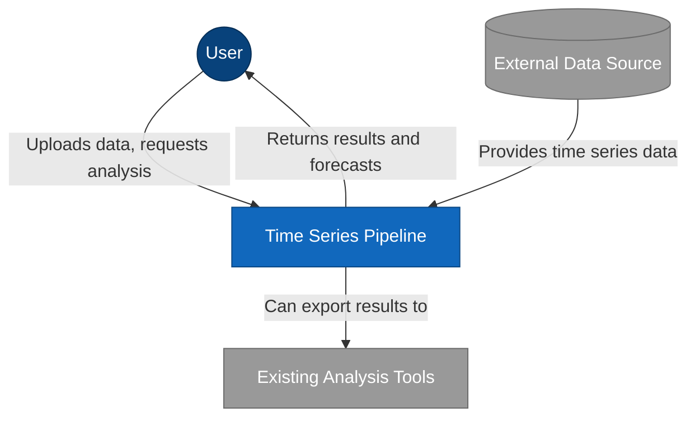
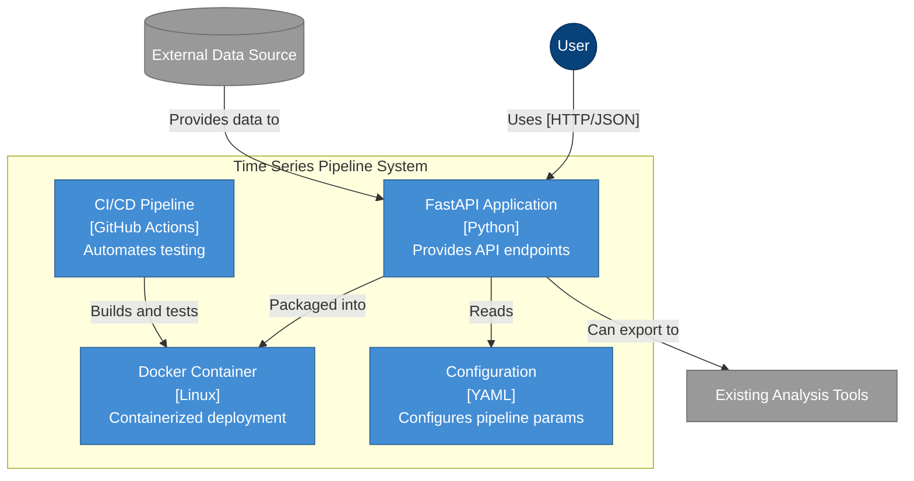
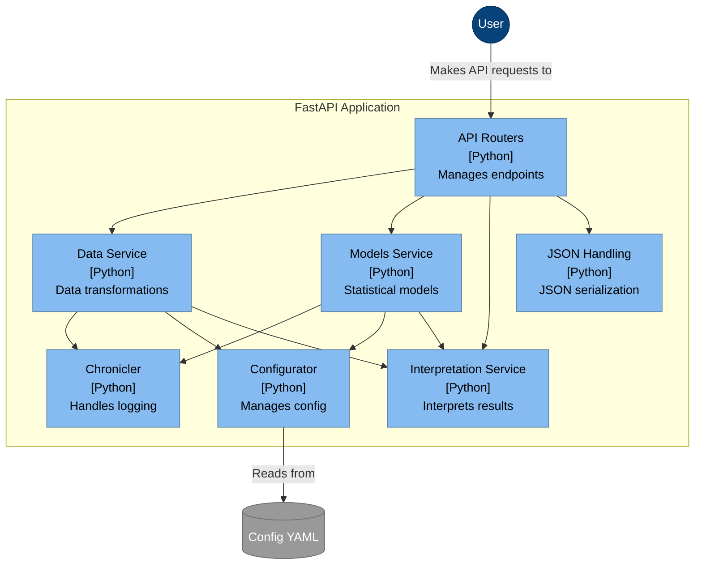

# Timeseries Pipeline


[](https://codecov.io/gh/garthmortensen/timeseries-pipeline)
[](https://app.codacy.com/gh/garthmortensen/timeseries-pipeline/dashboard)
[](https://hub.docker.com/r/goattheprofessionalmeower/timeseries-pipeline)

```ascii
   ▗▄▄▄▖▗▄▄▄▖▗▖  ▗▖▗▄▄▄▖ ▗▄▄▖▗▄▄▄▖▗▄▄▖ ▗▄▄▄▖▗▄▄▄▖ ▗▄▄▖
     █    █  ▐▛▚▞▜▌▐▌   ▐▌   ▐▌   ▐▌ ▐▌  █  ▐▌   ▐▌   
     █    █  ▐▌  ▐▌▐▛▀▀▘ ▝▀▚▖▐▛▀▀▘▐▛▀▚▖  █  ▐▛▀▀▘ ▝▀▚▖
     █  ▗▄█▄▖▐▌  ▐▌▐▙▄▄▖▗▄▄▞▘▐▙▄▄▖▐▌ ▐▌▗▄█▄▖▐▙▄▄▖▗▄gm▘
         ▗▄▄▖▗▄▄▄▖▗▄▄▖ ▗▄▄▄▖▗▖   ▗▄▄▄▖▗▖  ▗▖▗▄▄▄▖
         ▐▌ ▐▌ █  ▐▌ ▐▌▐▌   ▐▌     █  ▐▛▚▖▐▌▐▌   
         ▐▛▀▘  █  ▐▛▀▘ ▐▛▀▀▘▐▌     █  ▐▌ ▝▜▌▐▛▀▀▘
         ▐▌  ▗▄█▄▖▐▌   ▐▙▄▄▖▐▙▄▄▖▗▄█▄▖▐▌  ▐▌▐▙▄▄▖
```

TODO: generate diagrams with pyreverse. this project is complex and requires info to make it more understandable

TODO: Add mermaid visuals

TODO: Fix failed pytest and smoketest stemming from flattening of config

REJECTED: Add async webhooks. Webhooks are HTTP callbacks that are triggered by specific events. They're a way to notify other systems when something happens. I'm not doing this because of increased complexity and project scope.

WIP: Reproduce [thesis work](https://github.com/garthmortensen/finance/tree/master/15_thesis) as a production-grade api pipeline.

Take pdf writings and convert entirely. Then add supplementary generalized code.

## Features

- FastAPI endpoints for time series analysis
- OpenAPI response model for illustrating API contract
- ARIMA and GARCH modeling capabilities
- Data generation, scaling, and stationarity testing
- Docker containerization
- GitHub Actions CI/CD pipeline
- Comprehensive test suite

## Quick Start

Pull the Docker image:

```bash
docker pull goattheprofessionalmeower/timeseries-pipeline
```

Run the container:

```bash
docker run -d -p 8000:8000 --name timeseries-pipeline-container goattheprofessionalmeower/timeseries-pipeline:latest
```

## API Endpoints

| Endpoint | HTTP Verb | Description |
|----------|-----------|-------------|
| `/generate_data` | POST | Generate synthetic time series data |
| `/scale_data` | POST | Scale time series data |
| `/test_stationarity` | POST | Test for stationarity |
| `/run_arima` | POST | Run ARIMA model on time series |
| `/run_garch` | POST | Run GARCH model on time series |
| `/run_pipeline` | POST | Execute the full pipeline |

## Development

### Prerequisites

- Python 3.11+
- Docker (optional)

### Local Setup

1. Clone the repository:

   ```bash
   git clone https://github.com/garthmortensen/timeseries-pipeline.git
   cd timeseries-pipeline
   ```

2. Create a virtual environment:

   ```bash
   python -m venv venv
   source venv/bin/activate  # On Windows: venv\Scripts\activate
   ```

3. Install dependencies:

   ```bash
   pip install -r requirements.txt
   ```

4. Run the FastAPI app:

   ```bash
   python -m fastapi_pipeline.py
   # or
   make run-local
   ```

5. Access the API documentation:

   - Swagger: http://localhost:8001/docs
   - ReDoc: http://localhost:8001/redoc
   - OpenAPI spec: http://localhost:8001/api/openapi.json

### Configuration

The application uses a YAML configuration file at `config/config.yml`. You can customize:

- Data generation parameters
- Data processing strategies
- Model parameters for ARIMA and GARCH

### Testing

Run smoke tests (after launching app):

```bash
./smoketest.sh
```

Run the test suite:

```bash
pytest .
```

## Docker

Build the Docker image:

```bash
make docker-build
```

Run with Docker:

```bash
make docker-run
```

For interactive shell:

```bash
make docker-run-interactive
```

## Project Structure

```
timeseries-pipeline/
├── api/                    # API implementation
│   ├── cli_pipeline.py     # Command-line interface
│   └── fastapi_pipeline.py # FastAPI implementation
├── config/                 # Configuration files
│   └── config.yml          # Main configuration
├── tests/                  # Test suite
├── utilities/              # Utility modules
│   ├── chronicler.py       # Logging utilities
│   └── configurator.py     # Configuration utilities
├── .github/                # GitHub Actions workflows
├── Dockerfile              # Docker configuration
├── Makefile                # Development shortcuts
└── smoketest.sh            # API smoke tests
```

## CI/CD Pipeline

The project uses GitHub Actions for:

- Running tests on multiple Python versions and platforms
- Building and pushing Docker images
- Code coverage reporting

## Architecture Decisions

Statistical interpretations could be added to either:
1. Core computational python package
   pros: centralized statistical logic, interpretation close to logic making them consistent and sound
   cons: package scope creep
2. API layer
   pros: seperates domain/business logic from computation and presentation logic, centralized for all downstream. 
   cons: depedency on package, api is more than just data handoff
3. Frontend
   pros: -
   cons: bigger gap between computation and interpretation -> drift. Added frontend complexity.

Hence, maintain seperation of concerns and place interpretation in API. Data layer -> Business layer -> Presentation layer. API is a service that provides complete, consumable info.

## C4 mermaid diagrams

Each level of a C4 diagram provides a different level of zoom. This helps users understand a project at the most-useful granularity.

### Level 1: Context Diagram

Big picture of the pipeline. It's a map that shows who uses the system and what systems it talks to. You can use the pipeline to analyze externally sourced data.



### level 2: Container Diagram

Enhance! Zooms in one level to show the major building blocks/"containers". Containers are diff tech chunks that work together. The main engine is FastAPI, which reads from a `config.yml` file. It's all packed in a Docker container for easy deployment, and a CI/CD pipeline automates testing and building.



### level 3: Component Diagram

Enhance the API! Look inside the FastAPI app to see the key components. We can see various services like the Data Service for handling data, Models Service for statistical analysis, and Interpretation Service for making sense of results.



### level 4: Code/Class Diagram

Enhance the code to see classes! This shows some the classes involved in handling ARIMA and GARCH statistical models, including input classes that define what data goes in and response classes that define what comes back.

```mermaid
classDiagram
    %% Main Application Classes
    class App {
        +app: FastAPI
        +config: Config
    }
    
    %% Router Classes
    class DataRouter {
        +router: APIRouter
        +generate_data(input_data)
        +scale_data(input_data)
        +test_stationarity(input_data)
    }

    class ModelsRouter {
        +router: APIRouter
        +run_arima_endpoint(input_data)
        +run_garch_endpoint(input_data)
    }
    
    class PipelineRouter {
        +router: APIRouter
        +run_pipeline(pipeline_input)
    }
    
    %% Service Classes
    class DataService {
        +generate_data_step(pipeline_input, config)
        +fill_missing_data_step(df, config)
        +scale_data_step(df, config)
        +stationarize_data_step(df, config)
        +test_stationarity_step(df, config)
    }
    
    class ModelsService {
        +run_arima_step(df_stationary, config)
        +run_garch_step(df_stationary, config)
    }
    
    class InterpretationService {
        +interpret_stationarity_test(adf_results, p_value_threshold)
        +interpret_arima_results(model_summary, forecast)
        +interpret_garch_results(model_summary, forecast)
    }
    
    %% Utility Classes
    class JsonHandling {
        +round_for_json(obj, decimals)
        +RoundingJSONEncoder
        +RoundingJSONResponse
    }
    
    class Configurator {
        +read_config_from_fs(config_filename)
        +load_configuration(config_file)
    }
    
    class Chronicler {
        +init_chronicler()
        +log_file: str
    }
    
    class GitInfo {
        +run_git_command(command)
        +update_git_info()
        +get_info()
    }
    
    %% Input Models
    class BaseInputModel {
        <<abstract>>
    }
    
    class DataGenerationInput {
        +start_date: str
        +end_date: str
        +anchor_prices: dict
    }
    
    class ScalingInput {
        +method: str
        +data: list
    }
    
    class StationarityTestInput {
        +data: list
    }
    
    class ARIMAInput {
        +p: int
        +d: int
        +q: int
        +data: list
    }
    
    class GARCHInput {
        +p: int
        +q: int
        +data: list
        +dist: str
    }
    
    class PipelineInput {
        +start_date: str
        +end_date: str
        +anchor_prices: dict
        +scaling_method: str
        +arima_params: dict
        +garch_params: dict
    }
    
    %% Response Models
    class BaseResponseModel {
        <<abstract>>
    }
    
    class TimeSeriesDataResponse {
        +data: Dict[str, Dict[str, Any]]
    }
    
    class StationarityTestResponse {
        +adf_statistic: float
        +p_value: float
        +critical_values: Dict[str, float]
        +is_stationary: bool
        +interpretation: str
    }
    
    class ARIMAModelResponse {
        +fitted_model: str
        +parameters: Dict[str, float]
        +p_values: Dict[str, float]
        +forecast: List[float]
    }
    
    class GARCHModelResponse {
        +fitted_model: str
        +forecast: List[float]
    }
    
    class PipelineResponse {
        +stationarity_results: StationarityTestResponse
        +arima_summary: str
        +arima_forecast: List[float]
        +garch_summary: str
        +garch_forecast: List[float]
    }
    
    %% Core Statistical Models
    class StatsModels {
        +run_arima(df_stationary, p, d, q, forecast_steps)
        +run_garch(df_stationary, p, q, dist, forecast_steps)
    }
    
    %% Relationships
    App --> DataRouter: includes
    App --> ModelsRouter: includes
    App --> PipelineRouter: includes
    App --> Configurator: uses
    App --> Chronicler: uses
    
    DataRouter --> DataService: uses
    DataRouter --> DataGenerationInput: accepts
    DataRouter --> ScalingInput: accepts
    DataRouter --> StationarityTestInput: accepts
    DataRouter --> TimeSeriesDataResponse: returns
    DataRouter --> StationarityTestResponse: returns
    
    ModelsRouter --> ModelsService: uses
    ModelsRouter --> ARIMAInput: accepts
    ModelsRouter --> GARCHInput: accepts
    ModelsRouter --> ARIMAModelResponse: returns
    ModelsRouter --> GARCHModelResponse: returns
    
    PipelineRouter --> DataService: uses
    PipelineRouter --> ModelsService: uses
    PipelineRouter --> PipelineInput: accepts
    PipelineRouter --> PipelineResponse: returns
    
    DataService --> InterpretationService: uses
    DataService --> Configurator: uses
    DataService --> Chronicler: uses
    
    ModelsService --> InterpretationService: uses
    ModelsService --> StatsModels: uses
    ModelsService --> Configurator: uses
    ModelsService --> Chronicler: uses
    
    Chronicler --> GitInfo: uses
    
    BaseInputModel <|-- DataGenerationInput: extends
    BaseInputModel <|-- ScalingInput: extends
    BaseInputModel <|-- StationarityTestInput: extends
    BaseInputModel <|-- ARIMAInput: extends
    BaseInputModel <|-- GARCHInput: extends
    BaseInputModel <|-- PipelineInput: extends
    
    BaseResponseModel <|-- TimeSeriesDataResponse: extends
    BaseResponseModel <|-- StationarityTestResponse: extends
    BaseResponseModel <|-- ARIMAModelResponse: extends
    BaseResponseModel <|-- GARCHModelResponse: extends
    BaseResponseModel <|-- PipelineResponse: extends
```



## License

[MIT License](LICENSE). Have at it.

