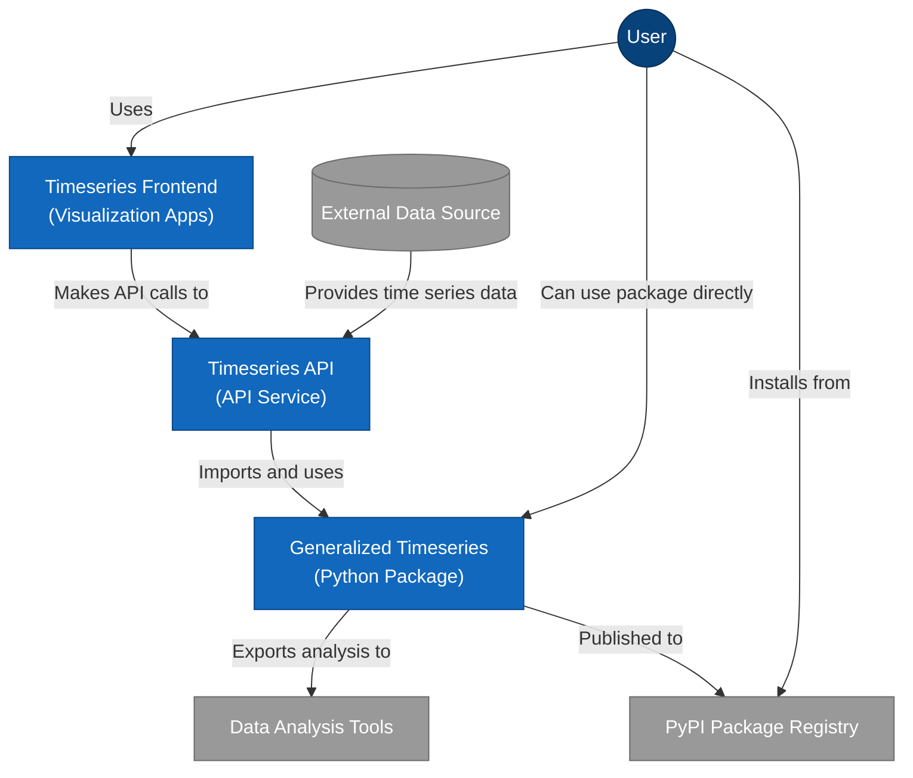
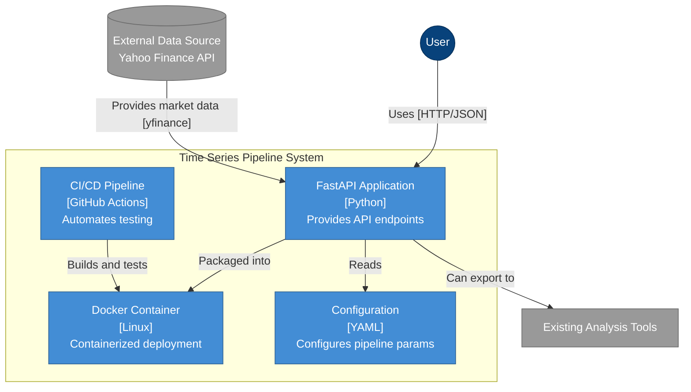
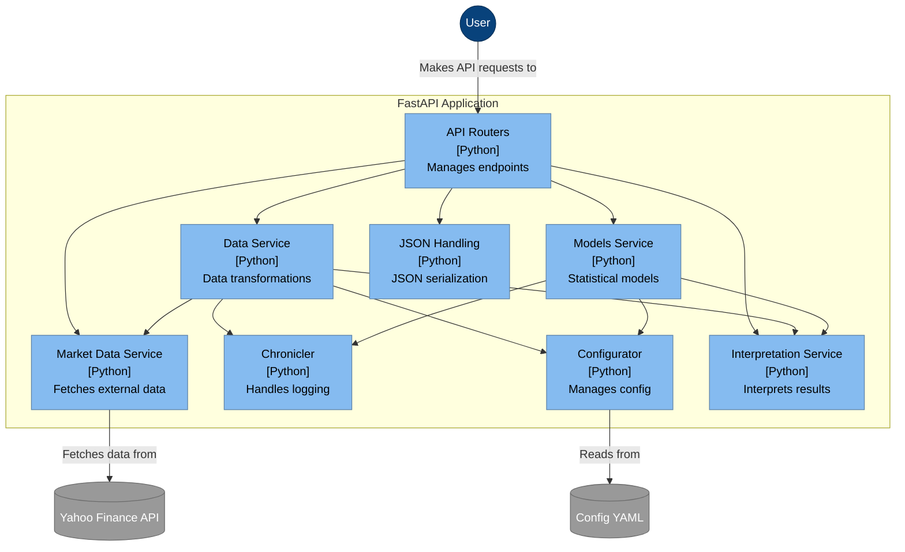
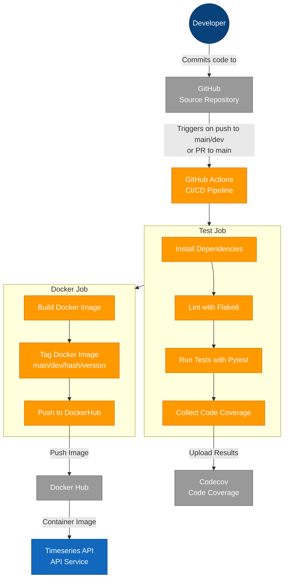

# Timeseries API

[](https://github.com/garthmortensen/timeseries-api)
[](https://hub.docker.com/r/goattheprofessionalmeower/timeseries-api)


[](https://app.codacy.com/gh/garthmortensen/timeseries-api/dashboard)
[](https://codecov.io/gh/garthmortensen/timeseries-api)

## Overview

```ascii
   ▗▄▄▄▖▗▄▄▄▖▗▖  ▗▖▗▄▄▄▖ ▗▄▄▖▗▄▄▄▖▗▄▄▖ ▗▄▄▄▖▗▄▄▄▖ ▗▄▄▖
     █    █  ▐▛▚▞▜▌▐▌   ▐▌   ▐▌   ▐▌ ▐▌  █  ▐▌   ▐▌   
     █    █  ▐▌  ▐▌▐▛▀▀▘ ▝▀▚▖▐▛▀▀▘▐▛▀▚▖  █  ▐▛▀▀▘ ▝▀▚▖
     █  ▗▄█▄▖▐▌  ▐▌▐▙▄▄▖▗▄▄▞▘▐▙▄▄▖▐▌ ▐▌▗▄█▄▖▐▙▄▄▖▗▄gm▘
         ▗▄▄▖▗▄▄▄▖▗▄▄▖ ▗▄▄▄▖▗▖   ▗▄▄▄▖▗▖  ▗▖▗▄▄▄▖
         ▐▌ ▐▌ █  ▐▌ ▐▌▐▌   ▐▌     █  ▐▛▚▖▐▌▐▌   
         ▐▛▀▘  █  ▐▛▀▘ ▐▛▀▀▘▐▌     █  ▐▌ ▝▜▌▐▛▀▀▘
         ▐▌  ▗▄█▄▖▐▌   ▐▙▄▄▖▐▙▄▄▖▗▄█▄▖▐▌  ▐▌▐▙▄▄▖
```

A production-grade FastAPI pipeline for time series analysis with ARIMA and GARCH modeling.

This project provides both a web API and CLI interface for financial and econometric data analysis.

### Features

- FastAPI endpoints for time series analysis
- OpenAPI response model for illustrating API contract
- ARIMA and GARCH modeling capabilities
- Data generation, scaling, and stationarity testing
- Docker containerization
- GitHub Actions CI/CD pipeline
- Comprehensive test suite

TODO: loathsome, but rename this from timeseries-pipline to timeseries-api or timeseries-api-rest or timeseries-interface

TODO: i have endpoints for a pipeline, which is probably passing dfs, and modular endpoints, which might best return dictionaries. think about what each endpoint should return.

### Architectural Overview



## Quick Start

### Docker

Pull the Docker image:

```bash
docker pull goattheprofessionalmeower/timeseries-api
```

Run the container:

```bash
docker run -d -p 8001:8001 --name timeseries-api-container goattheprofessionalmeower/timeseries-api:latest
```

### Local Setup

1. Clone the repository:

   ```bash
   git clone https://github.com/garthmortensen/timeseries-api.git
   cd timeseries-api
   ```

2. Create a virtual environment:

   ```bash
   python -m venv venv
   source venv/bin/activate  # On Windows: venv\Scripts\activate
   ```

3. Install dependencies:

   ```bash
   pip install -r requirements.txt
   ```

4. Run the FastAPI app:

   ```bash
   python -m fastapi_pipeline
   # or
   make run-local
   ```

### API Endpoints

| Endpoint | HTTP Verb | Description |
|----------|-----------|-------------|
| `/generate_data` | POST | Generate synthetic time series data |
| `/scale_data` | POST | Scale time series data |
| `/test_stationarity` | POST | Test for stationarity |
| `/run_arima` | POST | Run ARIMA model on time series |
| `/run_garch` | POST | Run GARCH model on time series |
| `/run_pipeline` | POST | Execute the full pipeline |

API docs:

- Swagger: http://localhost:8001/docs
- ReDoc: http://localhost:8001/redoc
- OpenAPI spec: http://localhost:8001/api/openapi.json

### Configuration

The application uses YAML configuration file `config/config.yml` to set:

- Data generation parameters
- Data processing strategies
- Model parameters for ARIMA and GARCH

## Development

### Project Structure

```text
timeseries-api/..................
├── cli_pipeline.py                  # For running the full pipeline from the terminal sans API
├── fastapi_pipeline.py              # For starting the API server with uvicorn
├── Makefile                         # For automating dev tasks
├── smoketest.sh                     # For quickly verifying endpoints are functional
├── config/........................... 
│   └── config.yml                   # For centralizing all pipeline params
├── api/..............................
│   ├── __init__.py                  # For making the API module importable and adding parent dir to path
│   ├── app.py                       # For FastAPI init() and registering routes
│   ├── models/.......................
│   │   ├── __init__.py              # For exporting all models and making the module importable
│   │   ├── input.py                 # For defining and validating request payload schemas
│   │   └── response.py              # For defining and validating response formats
│   ├── routers/......................
│   │   ├── __init__.py              # For exporting router instances and making the module importable
│   │   ├── data.py                  # For handling data generation and transformation endpoints
│   │   ├── models.py                # For implementing statistical modeling endpoints
│   │   └── pipeline.py              # For providing the end-to-end analysis pipeline endpoint
│   ├── services/.....................
│   │   ├── __init__.py              # For exporting service functions and making the module importable
│   │   ├── data_service.py          # For implementing data processing business logic
│   │   ├── models_service.py        # For implementing statistical modeling business logic
│   │   └── interpretations.py       # For generating human-readable explanations of statistical results
│   ├── utils/........................
│   │   ├── __init__.py              # For exporting utility functions and making the module importable
│   │   └── json_handling.py         # For handling JSON serialization NaN values (MacOS compatibility issue)
├── utilities/.......................
│   ├── chronicler.py               # For configuring standardized logging across the application
│   └── configurator.py             # For loading and validating YAML configuration
├── tests/...........................
│   ├── __init__.py                 # Makes tests discoverable
│   ├── test_chronicler.py          # test logging functionality
│   ├── test_configurator.py        # test configuration loading and validation
│   ├── test_fastapi_pipeline.py    # test API endpoints and response formats
│   ├── test_response_models.py     # validate response model schemas
│   └── test_yfinance_fetch.py      # test external market data fetching
└── .github/workflows/
            └── cicd.yml            # For automating testing and Docker image deployment
```

### Testing

Run smoke tests (after launching app):

```bash
bash smoketest.sh
```

Run the test suite:

```bash
pytest .
```

### Docker

Build the Docker image:

```bash
make docker-build
```

Run with Docker:

```bash
make docker-run
```

For interactive shell:

```bash
make docker-run-interactive
```

### CI/CD Pipeline

The project uses GitHub Actions for:

- Running tests on multiple Python versions and platforms
- Building and pushing Docker images
- Code coverage reporting

### Additional (C4) Architectural Diagrams

Each level of a C4 diagram provides a different level of zoom. This helps users understand a project at the most-useful granularity.

#### level 2: Container Diagram

Zooms in one level to show the major building blocks/"containers". Containers are diff tech chunks that work together. The main engine is FastAPI, which reads from a `config.yml` file. It's all packed in a Docker container for easy deployment, and a CI/CD pipeline automates testing and building.



#### level 3: Component Diagram

Look inside the FastAPI app to see the key components. We can see various services like the Data Service for handling data, Models Service for statistical analysis, and Interpretation Service for making sense of results.



#### level 4: Code/Class Diagram

Shows the classes involved in handling ARIMA and GARCH statistical models, including input classes that define what data goes in and response classes that define what comes back.


#### CI/CD Process

Triggers: Runs when code is pushed to branches main or dev, or when pull requests target main
Testing: Validates code across multiple Python versions (3.11, 3.13) and operating systems (Ubuntu, macOS)
Docker: Builds and publishes container images to Docker Hub
Quality: Uploads test results and coverage metrics to Codecov


